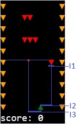

# Asteroids-ai
## Overview
The main goal of this project is to create computer bot for playing simple asteroids game, where the bot must avoid asteroids and walls, using neural network and genetic algorithm for evolution.

[Live demo](https://haturihanzo.github.io/Asteroids-ai/)

## Solution
### Neural network setup:
#### Architecture:
Perceptron with 3 neurons on input layer, 6 on hidden layer and 2 on output layer
#### Input layer:
1. The nearest asteroid width(I1)
2. Offset to the nearest asteroid center(I2)
3. Offset to the center of the widest space in the nearest asteroid line(I3)

#### Output layer:
1. Movement necessity(O1)
2. Movement direction(O2)

#### Learning:
Networks learning is based on genetic algorithm:
1. Generate random population
2. Start the game for each unit 
3. Calculate fitness function for each unit based on amount of avoided asteroids and movements quantity
4. Select best units using roulette wheel selection
5. Crossover selected bots networks(swap network biases and weights)
6. Randomly mutate bots networks biases and weights
7. Back to the step 2
